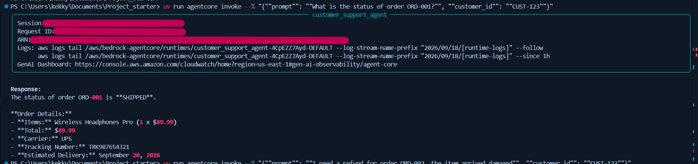
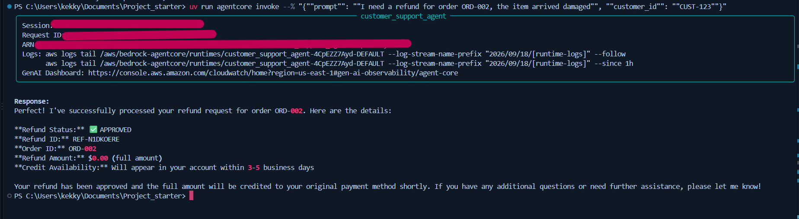
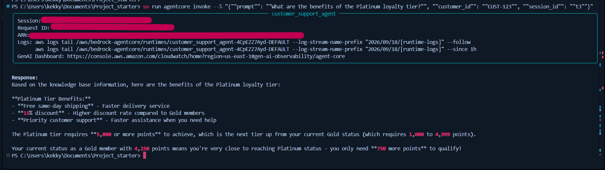
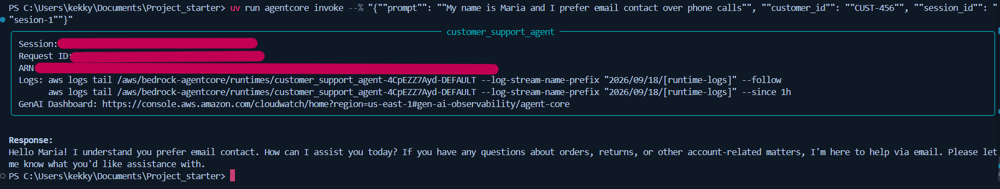
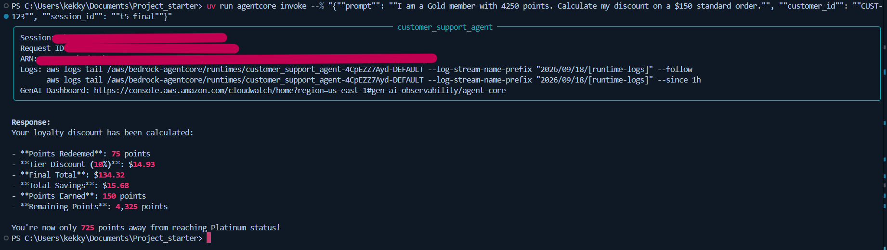
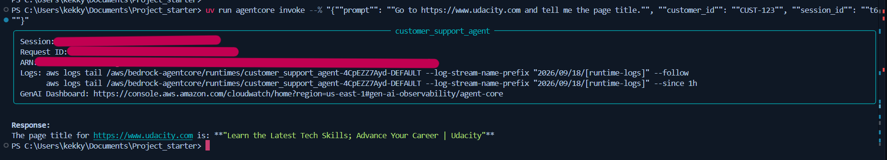

# Customer Support AI Agent — Amazon Bedrock AgentCore

An intelligent customer support assistant for an e-commerce platform, built on **Amazon Bedrock AgentCore**. The agent handles multi-step customer support workflows — order tracking, refund processing, product recommendations, and loyalty reward calculations — while maintaining conversational context across sessions.

This project was built as part of Udacity's AI Agents with AWS course, and integrates the core AgentCore capabilities: agent runtime deployment, tool integration via Gateway, retrieval-augmented generation (RAG), persistent memory, sandboxed code execution, and web browsing.

## Architecture

| Component | AWS Service | Purpose |
|---|---|---|
| Agent runtime | Bedrock AgentCore Runtime | Hosts and runs the agent |
| Tool integration | AgentCore Gateway | Exposes REST API and Lambda functions as MCP tools |
| Order tracking | AWS Lambda + API Gateway | Looks up order and customer data |
| Refund processing | AWS Lambda | Handles refund requests directly |
| Knowledge retrieval | Bedrock Knowledge Base (RAG) | Answers questions about policies, product specs, and loyalty tiers |
| Persistent memory | AgentCore Memory | Remembers customer facts and preferences across sessions |
| Calculations | AgentCore Code Interpreter | Runs exact loyalty discount math in a sandbox |
| Web browsing | AgentCore Browser Tool | Retrieves live information from external websites |
| Model | Amazon Nova Lite | Powers the agent's reasoning and responses |

The agent is built with the [Strands Agents](https://strandsagents.com/) framework, and orchestrates all of the above through a single entrypoint (`main.py`).

## Test Results

### Test 1 — Order Tracking


### Test 2 — Refund Processing


### Test 3 — Knowledge Base (RAG)


### Test 4 — Long-Term Memory (Two Sessions)



### Test 5 — Loyalty Discount Calculation


### Test 6 — Browser Tool


## Setup & Deployment

```bash
# Install dependencies
uv sync

# Configure AWS credentials
aws configure

# Generate the AgentCore configuration file
uv run agentcore configure --entrypoint main.py --name customer_support_agent

# Deploy
uv run agentcore deploy --local-build

# Invoke
uv run agentcore invoke '{"prompt": "Hello", "customer_id": "CUST-123", "session_id": "s1"}'
```

Before deploying, the following AWS resources must be created:
- Two Lambda functions (`order-tracker`, `refund-processor`)
- A REST API in API Gateway, fronting the `order-tracker` Lambda
- An AgentCore Gateway exposing both as MCP tools
- A Bedrock Knowledge Base, synced from `product_catalog.txt` in S3
- An AgentCore Memory resource with `SEMANTIC` and `USER_PREFERENCE` strategies

## Reflection

**Design decision.** For the memory system, I used two separate memory strategies — `customer_facts` (semantic) and `customer_preferences` (user preference) — instead of a single general-purpose strategy. I chose this split because the two types of information are used differently: facts (like past orders or issues mentioned) are useful as background context, while preferences (like "prefers email over phone") should actively shape *how* the agent responds, not just what it knows. Keeping them in separate namespaces made it easier to reason about what the `retrieve_customer_context` hook was pulling in, and made the extracted memory records easier to inspect and debug individually.

**Challenge.** My biggest challenge was a long-term memory failure that took a while to diagnose. After deploying the agent and testing it, `list-memory-records` consistently returned an empty result, even after waiting several minutes. I worked backward through the pipeline: first confirming the Memory resource itself was `ACTIVE` with valid strategies, then checking whether short-term events were even being saved with `list-events` — which also came back empty. That told me the problem was upstream of AWS entirely: my code was never calling `create_event`. Re-reading `MemoryHook` line by line, I found the root cause was a Python indentation bug — `retrieve_customer_context`, `save_support_interaction`, and `register_hooks` had drifted outside the class body and become nested inside each other, so `register_hooks` was never actually defined as a class method. Strands silently registered no hooks at all, with no error thrown. Fixing the indentation so all methods sat correctly inside `MemoryHook`, then redeploying, resolved it immediately. The experience reinforced how important it is to verify each layer of a pipeline (AWS resource status → short-term persistence → long-term extraction) independently rather than assuming the deepest layer is where the bug lives.

**Production considerations.** To take this agent to production, I would add automated retries and circuit breakers around external calls (Gateway, Knowledge Base, Code Interpreter, Browser Tool) so a single failing dependency doesn't fail the whole turn. I would also add structured logging and tracing per request (correlating `session_id` and `actor_id` across CloudWatch logs) to make debugging issues like the one above faster to catch. On the security side, I'd tighten the Lambda IAM roles to least-privilege and add an authorizer to the AgentCore Gateway instead of `NONE`. Finally, I'd add automated evaluation — a set of regression prompts run against the agent after every deploy — to catch cases where a code change (like the indentation bug) silently breaks a capability without throwing a visible error.

## Cleanup

To avoid ongoing charges, all resources should be destroyed after grading:

```bash
uv run agentcore destroy
```

Then manually delete, in this order: the AgentCore Gateway, the AgentCore Memory resource, the Knowledge Base, the OpenSearch Serverless collection, the S3 bucket, the API Gateway REST API, and the two Lambda functions.
